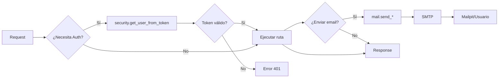
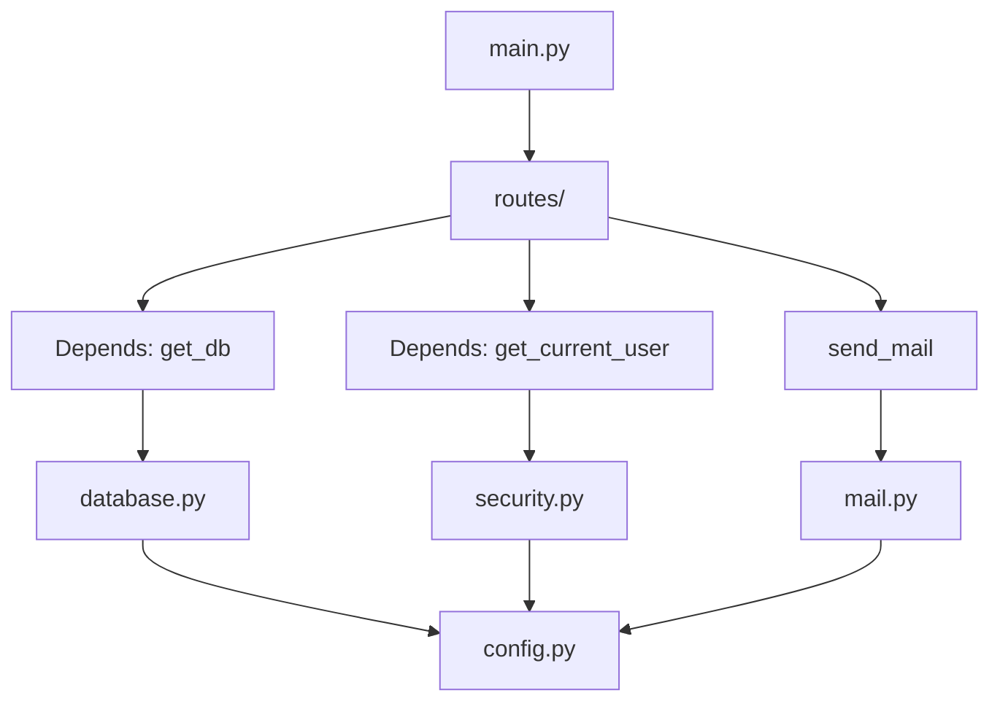
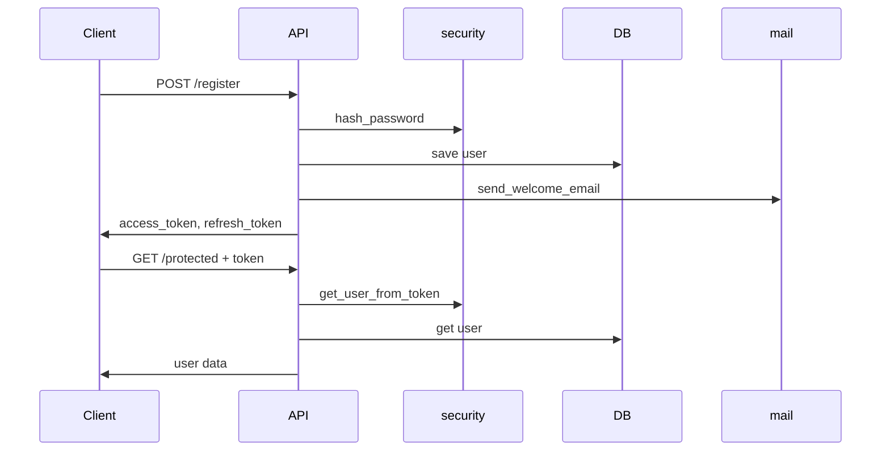

# Core - Centro de Configuración

El directorio `core/` contiene la configuración centralizada de la aplicación.

## Archivos

### `config.py`
**Gestión de variables de entorno**

```python
from app.core.config import settings

# Acceder a variables
print(settings.DATABASE_URL)
print(settings.SECRET_KEY)
```

**Variables disponibles:**
- `DATABASE_URL` - Conexión a PostgreSQL
- `SECRET_KEY` - Clave para firmar tokens JWT
- `ALGORITHM` - Algoritmo de encriptación (HS256)
- `ACCESS_TOKEN_EXPIRE_MINUTES` - Duración de tokens de acceso
- `MAIL_*` - Configuración SMTP para emails

---

### `database.py`
**Configuración de SQLAlchemy y conexión BD**

```python
from app.core.database import get_db
from sqlalchemy.orm import Session


@router.get("/users")
async def get_users(db: Session = Depends(get_db)):
    users = db.query(User).all()
    return users
```

**Componentes:**
- `engine` - Motor SQLAlchemy configurado
- `SessionLocal` - Sesiones de BD
- `Base` - Clase base para modelos ORM
- `get_db()` - Dependencia FastAPI para inyectar sesión

---

### `security.py`
**Autenticación JWT y hashing de contraseñas**

#### Funciones disponibles:

```python
from app.core.security import (
    hash_password,
    verify_password,
    create_access_token,
    create_refresh_token,
    decode_token,
    get_user_from_token,
    generate_token_pair,
)

# Hashear contraseña
hashed = hash_password("mi_contraseña_123")

# Verificar contraseña
is_valid = verify_password("mi_contraseña_123", hashed)

# Crear token de acceso (válido 30 min)
token = create_access_token(data={"sub": "123"})

# Crear token de refresco (válido 7 días)
refresh_token = create_refresh_token(data={"sub": "123"})

# Decodificar token
payload = decode_token(token)

# Obtener user_id del token
user_id = get_user_from_token(token)

# Generar par de tokens
tokens = generate_token_pair(user_id=456)
# Retorna: {"access_token": "...", "refresh_token": "...", "token_type": "bearer"}
```

#### Ejemplo en ruta protegida:

```python
from fastapi import APIRouter, Depends, HTTPException
from fastapi.security import HTTPBearer, HTTPAuthCredentials

security = HTTPBearer()
router = APIRouter()


def get_current_user(credentials: HTTPAuthCredentials = Depends(security)):
    token = credentials.credentials
    user_id = get_user_from_token(token)

    if user_id is None:
        raise HTTPException(status_code=401, detail="Token inválido")

    return user_id


@router.get("/me")
async def get_profile(user_id: int = Depends(get_current_user)):
    return {"user_id": user_id}
```

---

### `mail.py`
**Envío de emails con plantillas HTML**

#### Funciones disponibles:

```python
from app.core.mail import (
    send_email,
    send_welcome_email,
    send_verification_email,
    send_password_reset_email,
    send_reservation_confirmation,
    send_cancellation_email,
)

# Email genérico
await send_email(email="user@example.com", subject="Hola", body="Este es el cuerpo", html_body="<h1>Este es HTML</h1>")

# Email de bienvenida
await send_welcome_email("user@example.com", "Juan")

# Email de verificación
await send_verification_email("user@example.com", token="jwt_token_aqui", base_url="http://localhost:3000")

# Email de reset de contraseña
await send_password_reset_email("user@example.com", token="jwt_token_aqui", base_url="http://localhost:3000")

# Confirmación de reserva
await send_reservation_confirmation(
    email="guest@example.com",
    reservation_id=123,
    hotel_name="Hotel Paradise",
    check_in="2026-06-10",
    check_out="2026-06-15",
    total_price=500.00,
    guest_name="Juan Pérez",
)

# Cancelación de reserva
await send_cancellation_email(
    email="guest@example.com", reservation_id=123, guest_name="Juan Pérez", refund_amount=400.00
)
```

#### Requisitos:

- El servicio `mailpit` debe estar corriendo (en Docker)
- Variables de entorno configuradas en `.env`:
  ```env
  MAIL_USERNAME=test@test.com
  MAIL_PASSWORD=password
  MAIL_FROM=noreply@alectours.com
  MAIL_PORT=1025
  MAIL_SERVER=mailpit
  MAIL_FROM_NAME=AlecTours
  MAIL_STARTTLS=False
  MAIL_SSL_TLS=False
  ```

#### Testing de emails:

Accede a http://localhost:8025 para ver los emails enviados durante desarrollo.

---

## Diagrama de Flujo



---

## Estructura de Dependencias



---

## Flujo de Autenticación



---

## Checklist de Setup

- [x] `config.py` - Variables de entorno cargadas
- [x] `database.py` - Conexión a PostgreSQL configurada
- [x] `security.py` - JWT y hashing implementados
- [x] `mail.py` - Emails con plantillas HTML
- [ ] Crear modelos en `app/models/`
- [ ] Crear schemas Pydantic en `app/schemas/`
- [ ] Crear routers de autenticación en `app/routes/auth.py`
- [ ] Incluir routers en `app/main.py`
- [ ] Configurar CORS en `app/main.py`
- [ ] Crear migraciones con Alembic

---

## Próximos Pasos

1. **Crear modelos** (User, Hotel, Reservation, etc.) en `app/models/`
2. **Crear schemas** (UserCreate, HotelResponse, etc.) en `app/schemas/`
3. **Crear rutas de autenticación** en `app/routes/auth.py`
4. **Generar migraciones**:
   ```bash
   alembic revision --autogenerate -m "Create tables"
   alembic upgrade head
   ```
5. **Crear servicios** en `app/services/` para lógica de negocio

---

## Referencias

- [FastAPI Security](https://fastapi.tiangolo.com/tutorial/security/)
- [SQLAlchemy ORM](https://docs.sqlalchemy.org/en/20/orm/)
- [PyJWT](https://pyjwt.readthedocs.io/)
- [FastAPI-Mail](https://sabuhitoglu.github.io/fastapi-mail/)
- [Passlib](https://passlib.readthedocs.io/)
